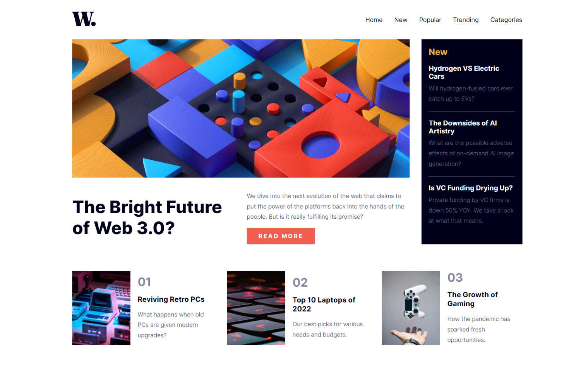

# Frontend Mentor - News homepage solution

This is a solution to the [News homepage challenge on Frontend Mentor](https://www.frontendmentor.io/challenges/news-homepage-H6SWTa1MFl). Frontend Mentor challenges help you improve your coding skills by building realistic projects. 

## Table of contents
- [Frontend Mentor - News homepage solution](#frontend-mentor---news-homepage-solution)
  - [Table of contents](#table-of-contents)
  - [Overview](#overview)
    - [Screenshot](#screenshot)
    - [Links](#links)
  - [My process](#my-process)
    - [Built with](#built-with)
  - [Author](#author)

## Overview

### Screenshot

### Links

- Solution URL: [Github repo](https://github.com/itsmemohit/fm-news-homepage)
- Live Site URL: [Netlify live site url](https://transcendent-piroshki-3d0796.netlify.app/)

## My process

### Built with

- Semantic HTML5 markup
- CSS custom properties
- Flexbox
- CSS Grid
- Mobile-first workflow
- JavaScript

## Author

- Website - [Mohit Dangwal](https://www.linkedin.com/in/mohit-dangwal-a17909171/)
- Frontend Mentor - [@itsmemohit](https://www.frontendmentor.io/profile/itsmemohit)
- Twitter - [@Mohitdangwal3](https://twitter.com/Mohitdangwal3)